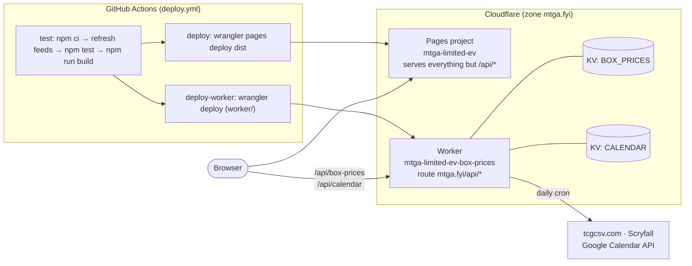

# Deploying

The app is a static client-side bundle on Cloudflare Pages, plus one Cloudflare
Worker that serves the two data feeds from KV on the same origin. Both ship from
`.github/workflows/deploy.yml`; nothing deploys from a laptop.

## Architecture



- **Pages** serves the built `dist/` (Vite). Uploads are **direct** from Actions
  rather than built by Pages, so builds do not count against Cloudflare's build
  quota and what ships is the artifact that passed the tests.
  `--branch=main` publishes production; every other branch gets its own preview
  URL, commented onto the pull request.
- **The Worker** (`worker/`, config `worker/wrangler.jsonc`) is the only server
  side. A Workers route on the custom domain takes precedence over Pages for
  matching paths, which puts it on `/api/*` and leaves Pages everything else. It
  has no `workers.dev` origin and no preview URLs. It imports the feed modules
  from `scripts/box-prices/` and `scripts/calendar/` relatively, so the checkout
  is needed at deploy time, not just `worker/`.
- **Two crons**, dispatched on `controller.cron` in `worker/src/index.ts`:
  `23 21 * * *` refreshes box prices, `41 9 * * *` refreshes the calendar. They
  are separate invocations because of the free plan's 50-subrequest budget. A
  failed run leaves the previous KV value serving.
- **The app fetches both feeds same-origin** (`src/liveBoxPrices.ts`,
  `src/liveCalendar.ts`), preloaded from `index.html`. Where the feed cannot be
  reached — every preview deploy, and local dev — it falls back to the copies
  checked in at `src/data/box-prices.json` and `src/data/mtg-calendar.json`,
  which CI refreshes at the top of each build.
- **The CSP** in `public/_headers` is `connect-src 'self'`, so any new data source
  must be proxied through the Worker rather than fetched from the page.
- **`mtga-limited-ev.awknaust.me`** 301s to `https://mtga.fyi` (path and query
  preserved) through a Single Redirect on the `awknaust.me` zone. It has no
  deploy of its own.

## The pipeline

| Job | Runs on | Does |
| --- | --- | --- |
| `test` | every push, PR, and `workflow_dispatch` | `npm ci`, refresh the two shipped feed copies, `npm test`, `npm run build`, upload `dist` |
| `deploy` | push / dispatch / same-repo PR, non-Dependabot | downloads that `dist` and uploads it to Pages |
| `deploy-worker` | `main` only, push or dispatch | `wrangler deploy` from `worker/` |

Forked-PR and Dependabot runs get the tests but not the deploys, because GitHub
withholds the Cloudflare secrets from them. `workflow_dispatch` is the manual
trigger for when a push never produces a run.

## Secrets and configuration

### GitHub repository secrets

Four, all under **Settings → Secrets and variables → Actions**:

| Secret | Used by | What it is |
| --- | --- | --- |
| `CLOUDFLARE_API_TOKEN` | `deploy`, `deploy-worker` | API token, scopes below |
| `CLOUDFLARE_ACCOUNT_ID` | `deploy`, `deploy-worker` | account id from the Cloudflare dashboard |
| `GOOGLE_CALENDAR_ID` | `test`, on non-PR runs | the public calendar's id |
| `GOOGLE_API_KEY` | `test`, on non-PR runs | Google Cloud API key, Calendar API enabled |

The two Google secrets are deliberately **not** passed on pull requests: that job
runs lifecycle scripts from an unreviewed lockfile. Their absence is not an
error — the refresh step is `continue-on-error` and the build ships the
checked-in calendar copy with a warning.

### Cloudflare API token scopes

Create at **My Profile → API Tokens** with:

| Scope | Level | Needed for |
| --- | --- | --- |
| Account → Cloudflare Pages | Edit | `wrangler pages deploy` |
| Account → Workers Scripts | Edit | `wrangler deploy` |
| Account → Workers KV Storage | Edit | the Worker's two KV bindings |
| Zone → Workers Routes (zone `mtga.fyi`) | Edit | the `mtga.fyi/api/*` route |

Cloudflare's **Edit Cloudflare Workers** template covers the last three and adds
Account Settings: Read; Pages must be added to it.

### Worker secrets

Two, set out of band and in no committed file. From `worker/`:

```bash
npx wrangler secret put GOOGLE_CALENDAR_ID
npx wrangler secret put GOOGLE_API_KEY
```

They are typed by hand in `worker/env.d.ts` — `wrangler types` only knows what
`wrangler.jsonc` declares. Do not declare them as `vars` in `wrangler.jsonc`
instead: a `var` is committed plaintext and silently overrides the secret of the
same name.

Only `/api/calendar` uses them. The box-price sources need no credential.

### Google Cloud

- The calendar must be **public** (Settings and sharing → make available to
  public). Its id comes from **Integrate calendar → Calendar ID**.
- The API key needs the **Google Calendar API** enabled and should be restricted
  to it. A key is required even for a public calendar — `googleapis.com` refuses
  unregistered callers, so it is caller identity for quota, not read permission.

### Local development

Only `npm run calendar` needs credentials. Copy the template and fill it in:

```bash
cp .env.example .env    # gitignored; .env.example is not
```

`package.json` loads it with Node's `--env-file-if-exists`, so a missing file is
a note rather than an error, and the **shell wins** — an exported variable is not
overridden by the file. Agents are blocked from reading or writing `.env` by
`.claude/settings.json` and a `PreToolUse` hook.

To exercise the live feed path in dev, point Vite at a local Worker:

```bash
cd worker && npx wrangler dev          # one shell
MTGA_EV_API_PROXY=http://localhost:8787 npm run dev   # the other
```

Wrangler prints the port it took; name that one. Without the variable, dev
behaves like a preview and uses the shipped copies.

## Resources created once, by hand

Not in code, and needed to stand this up from scratch:

- The Cloudflare **zone** `mtga.fyi`.
- The **Pages project** `mtga-limited-ev`, production branch `main`, with
  `mtga.fyi` attached as a custom domain.
- Two **KV namespaces**; their ids are in `worker/wrangler.jsonc` and are not
  secrets.
- **Web Analytics** on the zone with `auto_install`, which is why
  `static.cloudflareinsights.com` appears in the CSP's `script-src`.
- The **Single Redirect** on the `awknaust.me` zone.
- GitHub **environments** `production` and `preview` (public repos only on the
  free plan), which give the deploy a tracked URL.

## What breaks if something is missing

| Missing | Effect |
| --- | --- |
| `CLOUDFLARE_API_TOKEN` / `CLOUDFLARE_ACCOUNT_ID` | both deploy jobs fail; nothing ships |
| `GOOGLE_*` repo secrets | build is green; the shipped calendar copy is whatever was last committed |
| `GOOGLE_*` Worker secrets | `/api/calendar` 503s; the app renders the shipped copy |
| KV cold (first request after a first deploy) | the Worker builds the feed inline and stores it |
| A source outage during a cron | previous KV value keeps serving |
